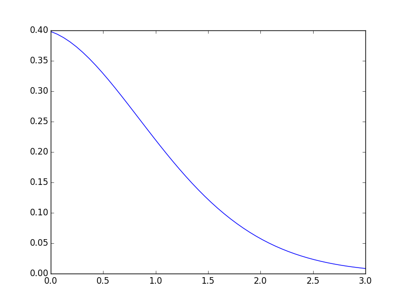
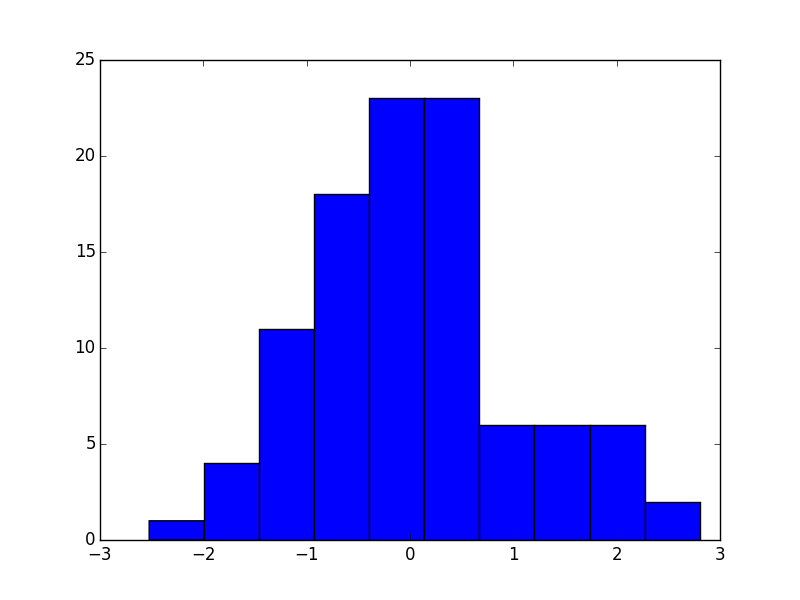

```python
from scipy.stats import pearson3
numargs = pearson3.numargs
[ skew ] = [0.3,] * numargs
rv = pearson3(skew)
x = np.linspace(0, np.minimum(rv.dist.b, 3))
h = plt.plot(x, rv.pdf(x))
plt.savefig('test_01.png'); plt.hold(False)
```




```python
R = pearson3.rvs(skew, size=100)
plt.hist(R)
plt.savefig('test_02.png'); plt.hold(False)
```



```python
print pearson3.numargs
```


