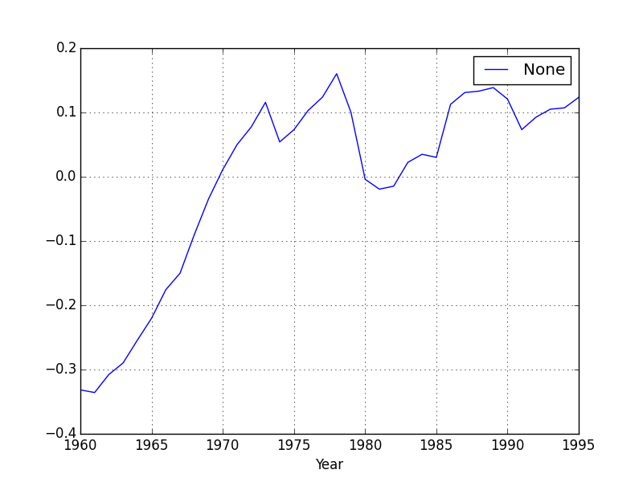

Year	= Year, 1953-2004,
GasExp = Total U.S. gasoline expenditure,
Pop	= U.S. total population in thousands
GasP	= Price index for gasoline,
Income	= Per capita disposable income,
Pnc	= Price index for new cars,
Puc	= Price index for used cars,
Ppt	= Price index for public transportation,
Pd	= Aggregate price index for consumer durables,
Pn	= Aggregate price index for consumer nondurables,
Ps	= Aggregate price index for consumer services.


```python
import pandas as pd

df = pd.read_csv('TableF2-2.csv')
plt.plot(df.GASP,df.GASEXP,'.')
plt.savefig('test_01.png')
plt.hold(False)
```




```python
plt.plot(df.YEAR,np.log(df.GASEXP/df.POP*1000),'.')
plt.hold(False)
plt.savefig('test_02.png')
plt.hold(False)
```


