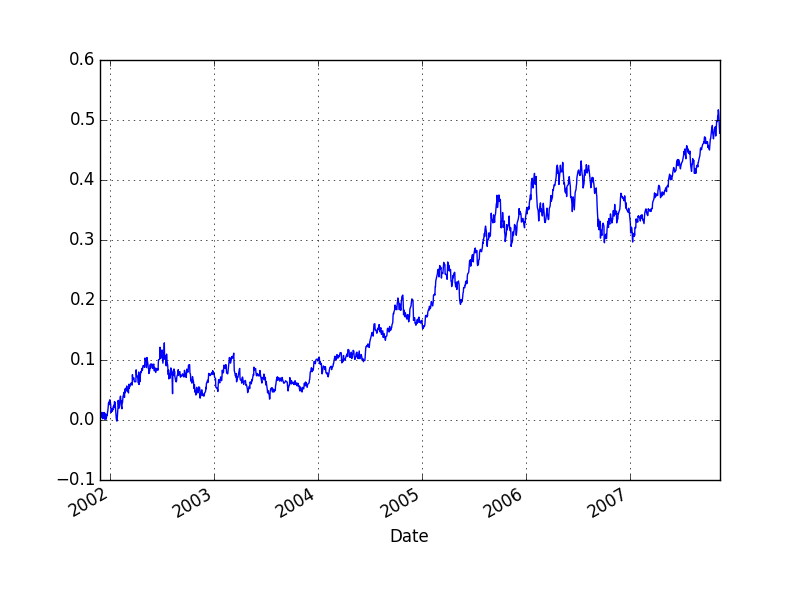

## Sharpe

http://edge-fund.com/Lo02.pdf

http://www.rinfinance.com/agenda/2012/talk/StevenPav.pdf

```python
import pandas as pd
import pandas.io.excel as xl
ige = xl.read_excel('IGE.xls')
ige = ige.sort(columns='Date')
ige['Returns'] = ige['Adj Close'].pct_change()
print len(ige)
print ige.head()
```

```text
1504
           Date   Open   High    Low  Close  Volume  Adj Close   Returns
1503 2001-11-26  91.01  91.01  91.01  91.01       0      42.09       NaN
1502 2001-11-27  91.01  91.01  91.01  91.01       0      42.09  0.000000
1501 2001-11-28  91.01  91.01  91.01  91.01       0      42.09  0.000000
1500 2001-11-29  91.01  91.01  91.01  91.01       0      42.09  0.000000
1499 2001-11-30  91.32  91.32  91.32  91.32     200      42.23  0.003326
```

```python
ige['excessRet'] = ige['Returns'] - 0.04/252.
sharpeRatio = np.sqrt(252.)*ige['excessRet'].mean() / ige['excessRet'].std()
print sharpeRatio
```

```text
0.789317538345
```

```python
import pandas.io.excel as xl
spy = xl.read_excel('SPY.xls')
spy = spy.sort(columns='Date')
spy['Returns'] = spy['Adj Close'].pct_change()
spy['netRet']=(ige['Returns'] - spy['Returns'])/2.;
spy['cumret']=(1+spy['netRet']).cumprod()-1.0
print spy.head()
```

```text
        Date    Open    High     Low   Close    Volume  Adj Close   Returns  \
0 2001-11-26  115.75  116.34  115.07  115.93  13726000     105.52       NaN   
1 2001-11-27  115.62  116.90  114.09  115.43  19261400     105.06 -0.004359   
2 2001-11-28  114.74  115.17  113.25  113.34  20195500     103.16 -0.018085   
3 2001-11-29  113.66  114.92  113.00  114.87  16354700     104.55  0.013474   
4 2001-11-30  114.40  114.91  114.02  114.05  13680300     103.81 -0.007078   

     netRet    cumret  
0       NaN       NaN  
1  0.011869  0.011869  
2 -0.014389 -0.002691  
3 -0.015510 -0.018160  
4  0.006784 -0.011498  
```

```python
spy['cumret'].plot()
plt.savefig('example3_4_01.png'); plt.hold(False)
```




## Max Drawdown

http://stackoverflow.com/questions/21058333/compute-rolling-maximum-drawdown-of-pandas-series

```python
def max_dd(ser):
    # max dd
    max2here = pd.expanding_max(ser)
    dd2here = ser - max2here
    # max dd duration
    ser2 = ser.fillna(method='bfill')
    i = np.argmax(np.maximum.accumulate(ser2) - ser2)
    j =   np.argmax(ser2[:i])
    return dd2here.min(), i-j
print max_dd(spy['cumret'])
```

```text
(-0.36709435125558532, 238)
```

```python
n = 1000
xs = np.random.randn(n).cumsum()
i = np.argmax(np.maximum.accumulate(xs) - xs) # end of the period
j = np.argmax(xs[:i]) # start of period
plt.hold(False)
plt.plot(xs)
plt.hold(True)
plt.plot([i, j], [xs[i], xs[j]], 'o', color='Red', markersize=10)
plt.savefig('example3_4_02.png')
```


```python
spy = spy.fillna(method='bfill')
arr = np.array(spy['cumret'])
print arr
```

```text
[ 0.01186898  0.01186898 -0.00269089 ...,  0.45771947  0.43550371
  0.43550371]
```


```python
spy = spy.fillna(method='bfill')
arr = np.array(spy['cumret'])
i = np.argmax(np.maximum.accumulate(arr) - arr)
j = np.argmax(arr[:i])
plt.hold(False)
plt.plot(arr)
plt.hold(True)
plt.plot([i, j], [arr[i], arr[j]], 'o', color='Red', markersize=10)
plt.savefig('example3_4_03.png')
```

```python
import pandas.io.excel as xl
import pandas as pd
import datetime
df = xl.read_excel('GLD.xls',parse_dates=True)
df['Date'] = df['Date'].apply(lambda x: int(pd.to_datetime(x).strftime('%Y%m%d')))
print df.head()
import scipy.io as sio
sio.savemat('GLD.mat', {'gld': np.array(df)}, format='4')
```

```text
       Date   Open   High    Low  Close   Volume  Adj Close
0  20071130  78.35  78.60  76.98  77.32  9509100      77.32
1  20071129  79.28  79.33  78.28  78.28  9306700      78.28
2  20071128  79.42  79.87  78.76  79.57  9706700      79.57
3  20071127  80.70  80.89  79.81  80.10  7229900      80.10
4  20071126  82.25  82.25  81.13  81.30  7440200      81.30
```


