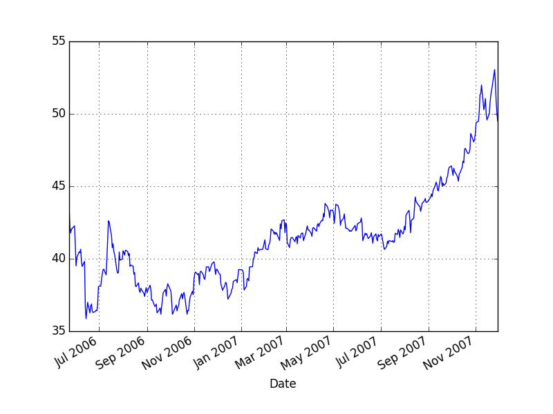

```python
import pandas.io.excel as xl
import pandas as pd
import datetime
df = xl.read_excel('GLD.xls',parse_dates=True)
df['Date'] = df['Date'].apply(lambda x: int(pd.to_datetime(x).strftime('%Y%m%d')))
print df.head()
import scipy.io as sio
sio.savemat('GLD.mat', {'gld': np.array(df)}, format='4')
```

```text
       Date   Open   High    Low  Close   Volume  Adj Close
0  20071130  78.35  78.60  76.98  77.32  9509100      77.32
1  20071129  79.28  79.33  78.28  78.28  9306700      78.28
2  20071128  79.42  79.87  78.76  79.57  9706700      79.57
3  20071127  80.70  80.89  79.81  80.10  7229900      80.10
4  20071126  82.25  82.25  81.13  81.30  7440200      81.30
```

```python
import pandas as pd
gld = xl.read_excel('GLD.xls',parse_dates=True,index_col='Date')
gdx = xl.read_excel('GDX.xls',parse_dates=True,index_col='Date')
df = pd.DataFrame(index=gld.index)
df['gld'] = gld['Adj Close']
df['gdx'] = gdx['Adj Close']
df = df.dropna()
```

```python
import statsmodels.formula.api as smf
results = smf.ols('gdx ~ gld', data=df).fit()
print results.params['gld']
```

```text
0.613232143393
```

```python
hedgeRatio = results.params['gld']
df['spread'] = df['gld'] - hedgeRatio*df['gdx']
trainset = df[0:251]
df['spread'].plot()
plt.savefig('example3_6_01.png'); plt.hold(False)
```




```python
plt.hold(True)
df[['gld','gdx']].plot()
plt.savefig('example3_6_02.png'); plt.hold(False)
```


