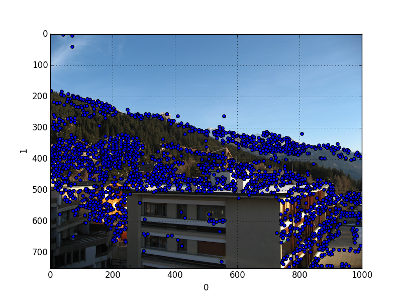

`siftpy1` is based on the 0.8.0 version of SIFT written by Andrea
Vedaldi which is not the latest version anymore, however the new
version by Vedaldi has a lot of extra code and scripting that handled
interfacing to Octave for instance, or Windows portability; we needed
a cleaner C code that would build simply. Another reason for writing
this interface was that another Python interface to the most current
Vedaldi sift, called `pyvlfeat` failed to compile.

This interface is very simple; I hacked through the `sift-driver.cpp`
mainline code. We pass a filename to `pysift1` which is passes on to
Vedaldi's sift that reads it, as though as the command is coming from
the outside. Basically this is a wrapper to command line sift that
works through dynamic libraries, the advantage is no shell execution
is needed. We parse the output automatically as well, and return it as
a Pandas dataframe.

Usage

```python
import siftpy1
df = siftpy1.sift("test.pgm",threshold=10.0)
```

The variable `df` is a Pandas dataframe that carries the SIFT
descriptors; first 4 columns are location / angle, the last 128 are
the descriptors themselves.




Here is Mr. Vedaldi talking about the previous version of this
interface (I updated the link so it points to this one).

http://vision.ucla.edu/~vedaldi/code/siftpp.html

### Resources

Solem, *Computer Vision with Python*

http://vlfeat.org
