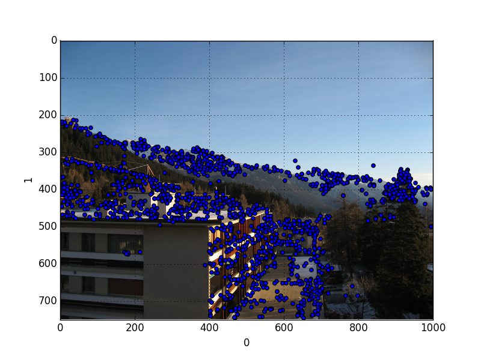

```python
from PIL import Image
import sys
from pylab import *
```

```python
import pandas as pd
df = pd.read_csv('/tmp/out.key',sep=' ',header=None)
res = np.array(df[[0,1]])
```

```python
print len(res)
```

```text
2939
```

```python
im=Image.open("crans_1_small.jpg")
df.plot(kind='scatter',x=0,y=1)
plt.hold(True)
plt.imshow(im)
plt.savefig('test_02.png')
```


```python
im=Image.open("crans_1_small.jpg")
res = np.array(df[[0,1]])
for x in res: plt.plot(x[0],x[1],'o'); plt.hold(True)
plt.hold(True)
plt.imshow(im)
plt.savefig('test_02.png')
```




